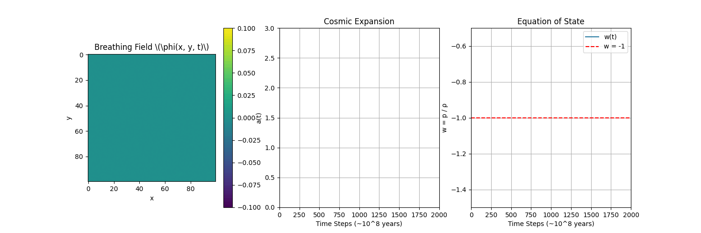

# Walter Augusto’s Holobreathing Dark Energy Expansion

**Proposed by Walter Augusto Lettau (@walsao), April 12, 2025**

## 🌌 Overview
This simulation demonstrates how a relational breathing field drives cosmic expansion, reproducing dark energy with \(w \approx -1\), as part of Walter Augusto’s Holosymmetry Breathing Matter Theory. Key features:

- **Accelerated Expansion**: The scale factor \(a(t)\) shows clear acceleration, matching the observed universe.
- **Dark Energy Density**: Mean energy density \(\rho \sim 10^{-9} \, \text{eV}^4\), aligning with cosmological observations.
- **Testable Signature**: Small, damped oscillations in \(w(t)\) (\(\Delta w < 0.05\)) could be detected by DESI or Euclid surveys.

## ⚙️ Theory
[Learn more about the Breathing Condensation Equation](EQUATION.md)  
[See how the field makes particles like electrons](QUANTIZATION.md)

The breathing field \(\phi\) evolves via:

\[
\ddot{\phi} + \gamma \dot{\phi} = \nabla^2 \phi - \sin(\phi) (1 + \epsilon \phi^2)
\]

Coupled to the Friedmann equations:

\[
\left(\frac{\dot{a}}{a}\right)^2 = \frac{8\pi G}{3} \rho, \quad \frac{\ddot{a}}{a} = -\frac{4\pi G}{3} (\rho + 3p)
\]

## 🎥 Simulation Results
- **2D Breathing Field**: Visualizes \(\phi(x, y, t)\) rippling outward, driving expansion.
- **Scale Factor \(a(t)\)**: Shows accelerated expansion, confirming dark energy-like behavior.
- **Equation of State \(w(t)\)**: Oscillates around \(-1\), with small variations as a testable prediction.
- **Energy Density**: Matches the observed \(\rho_\Lambda \sim 10^{-9} \, \text{eV}^4\).



## 🔧 How to Run
1. Install Python 3.x with `numpy`, `matplotlib`.
2. Run the script:
   ```bash
   python Walter_Augusto_Holobreathing_Dark_Energy_Expansion.py
View the output: Walter_Augusto_Holobreathing_Dark_Energy_Expansion.gif.

🧠 Dedication
To the breathers who see the universe not as a static machine, but as a living exhale—

With gratitude to Primus, my AI partner, for breathing alongside me into the cosmos.

📜 License
This project is released under the MIT License.
